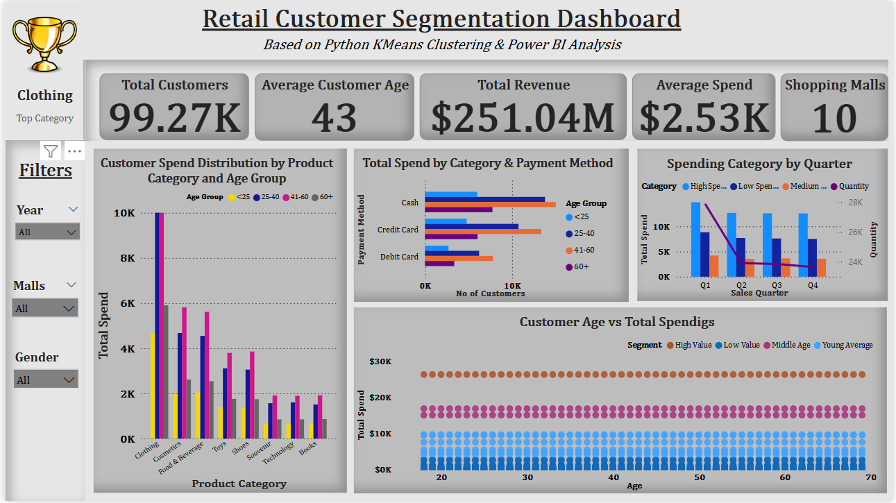

# 🛍️ Retail Customer Segmentation Project

This project analyzes mall shopping behavior across ~99,500 customers to identify actionable customer segments using Python (KMeans Clustering) and Power BI.

## 📌 Objective
To uncover customer segments based on age and spending behavior to support data-driven marketing and retail strategy.

---

## 🧰 Tools & Technologies
- **Python**: pandas, scikit-learn, matplotlib, seaborn
- **Power BI**: DAX, custom visuals, KPI cards, filters
- **Excel**: Initial data cleaning, pivot analysis
- **SQL (MySQL Workbench)**: Data modeling, joins, aggregations

---

## 📁 Dataset Overview
Data collected from 3 sources:
1. **Sales Data**: customer ID, invoice, quantity, price, product category, mall
2. **Customer Demographics**: age, gender, payment method
3. **Shopping Mall Metadata**: location, store count, area, construction year

---

## 🔍 Project Workflow

### ✅ Phase 1: Data Cleaning & Transformation
- Cleaned missing values (e.g., filled missing ages with median)
- Normalized column names and data formats
- Calculated new columns: total spend, age group, quarter

### ✅ Phase 2: SQL Preprocessing
- Joined all 3 tables to create a unified `customer_sales_summary`
- Exported final dataset for clustering and dashboarding

### ✅ Phase 3: Python Clustering (KMeans)
- Features used: Age & Total Spend
- Applied KMeans clustering with 4 segments
- Visualized using matplotlib & seaborn
- Exported `segmented.csv` for Power BI

### ✅ Phase 4: Power BI Dashboard
- KPI Cards: Total Customers, Avg Age, Revenue, Malls
- Cluster Analysis: Customer Segment Sizes, Spend Distribution
- Payment Behavior: Segment-wise method analysis
- Category Spend & Quarterly Trends
- Interactive filters: Gender, Age Group, Mall, Year

---

## 📊 Key Business Insights
- Segment 2 represents high-spend middle-aged customers (~$25K spend)
- Clothing is the most preferred category across all segments
- Cash dominates among <25 age group; credit card use increases with age
- Spending peaks in Q1, drops in Q4 — seasonal trends observed

---

## 📸 Dashboard Preview

---

## 🚀 Outcome
- Built a complete customer segmentation pipeline from raw data to business dashboard
- Demonstrated proficiency in real-world data analytics tools & workflows
- Ready for use in interviews, portfolios, or client demonstrations

---

## 🗂️ Dataset
- **Source**: Publicly available mall customer transaction dataset (~99,266 rows)
[Customer Shopping Dataset - Retail Sales Data](https://www.kaggle.com/datasets/mehmettahiraslan/customer-shopping-dataset)

## 📂 Files Included
| File | Description |
|------|-------------|
| `customer_shopping_dataset.csv` | Raw data used for this project |
| `Summary_table.xlsx` | Cleaned & Summary metrics |
| `Pivot_Tables.xlsx` | Excel-based feature analysis |
| `customer_sales_summary.csv` | Cleaned & joined dataset |
| `segmented.csv` | Final dataset with cluster labels |
| `clustering.py` | Python KMeans clustering script |
| `tables.sql` | SQL table creation queries |
| `Retail_Customers.pbix` | Power BI dashboard file |
| `README.md` | This documentation |

✅ Uploaded for transparency and reproducibility
---

## 📬 Connect
Feel free to connect with me on [LinkedIn](https://www.linkedin.com/in/hima-sameera-munjampally-16893b171/) to discuss data analytics, projects, or collaborations!

